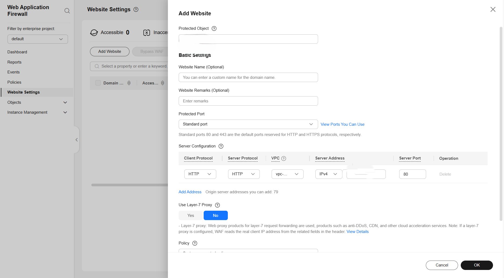

# Dedicated_WAF_ELB_Setup

# Pointing Traffic to an ECS Hosting Your Website

If your origin servers are deployed on **Huawei Cloud ECSs** and not behind any ELB, perform the following steps. 

---
YOU SHOULD HAVE SEPARATE SECURITY GROUPS FOR YOUR Dedicated WAF instances and ORIGIN SERVER:

## Step 1: Add a Website to WAF

To connect your services to **WAF**, you need to add the Domain name or IP address of the website you want to protect.
N.B If you are using domain name, that means you must have created a DNS record mapped the EIP of your ECS where your website is hosted. 
1. Log in to the **WAF console**.
2. Click **☰** in the upper left corner and select a **region** or **project**.
3. *(Optional)* If you have enabled the **enterprise project function**, in the upper part of the navigation pane on the left, select your enterprise project from the **Filter by enterprise project** drop-down list.  
   WAF will then display the related security data in the enterprise project on the page.
4. In the navigation pane on the left, click **Website Settings**.
5. In the upper left corner of the website list, click **Add Website**.
6. Select **Dedicated Mode** and click **Configure Now**.
7. On the **Add Website** panel, configure basic information (see **Table 1**).

> **POC1**: Configuring basic information  
> 

 - **Protected Object** - Domain name or IP address of the website you want to protect.
- **Protected Port** - The port used by the client to access the website server that should be protected.  
  To protect port 80 or 443, select **Standard port** from the drop-down list.  
  To protect other ports, choose one from the drop-down list. Click **View Ports You Can Use** to view the HTTP and HTTPS ports supported by WAF.  
  If a port other than 80 or 443 is configured, visitors need to add the non-standard port to the end of the website address when they access the website. Otherwise, a **404 error** will occur.
- **Server Configuration** - Information about the website server.
- **Layer-7 Proxy Used** - Check whether a layer-7 proxy is used before WAF. Layer-7 proxies include web proxy products, such as anti-DDoS (layer-7 proxy), CDN, and other cloud acceleration services.

---
## Step 2: Configure a Load Balancer for the Dedicated WAF Instances

To ensure your **dedicated WAF instance** reliability, after you add a website to it, use **Huawei Cloud Elastic Load Balance (ELB)** to configure a load balancer and a health check.  
*(Health check protocol of TCP and default backend server port should be fine).*

---

### Go to the ELB console and add a listener

1. In the upper left corner of the page, click **☰** and choose  
   **Networking > Elastic Load Balance**.
2. Click the **target load balancer name** to go to its details page.
3. Click the **Listeners** tab, then click **Add Listener**, and configure the listener information.

---

### Add WAF instances to the ELB

1. After creating an ELB for the WAF instances, go to the **WAF console**.
2. In the navigation pane on the left, choose  
   **Instance Management > Dedicated Engine**.
3. Locate the row containing the WAF instance.  
   In the **Operation** column, choose **More > Add to ELB**.
4. *(For CN East-Shanghai1 or CN North-Ulanqab1 regions)*  
   - You can select multiple running dedicated WAF instances that function as reverse proxies.  
   - Click **Add to Load Balancer** in the upper left corner of the instance list.  
   - Add them to a load balancer to distribute workloads across the dedicated WAF instances.

On the Add to ELB panel, select the ELB (Load Balancer), ELB Listener, and Backend Server Group configured, and click Next.
If Health Check is enabled, the health check result must be Normal, or the website requests cannot be pointed to WAF.
> **POC2**: Adding WAF instance to ELB Backen Server Group  

## Step 3: Obtain the subnet IP addresses of all dedicated WAF instances

1. Click **☰** in the upper left corner of the page and choose  
   **Web Application Firewall** under **Security & Compliance**.
2. In the navigation pane on the left, choose  
   **Instance Management > Dedicated Engine**.
3. On the **Dedicated Engine** page, click the **IP address** in the **IP Address** column of the dedicated engine and copy the address.

> **POC 3**: Obtaining the subnet IP address of a dedicated engine  
> 

---

## Step 4: Add the subnet IP address to the ECS security group

1. In the upper left corner of the page, click **☰** and choose  
   **Compute > Elastic Cloud Server**.
2. On the **Elastic Cloud Server** page, click the **target ECS instance name**.
3. On the **ECS details** page, click the **Security Groups** tab and then click **Change Security Group**.
4. On the **Change Security Group** panel displayed, select a security group or create a new one, then click **OK**.
5. Click the **security group ID** and view the details.
6. Click the **Inbound Rules** tab and then click **Add Rule**.
7. In the **Add Inbound Rule** dialog box, configure the parameters as shown in **Table 3**, then click **OK**.

> **Figure 8**: Add Inbound Rule
